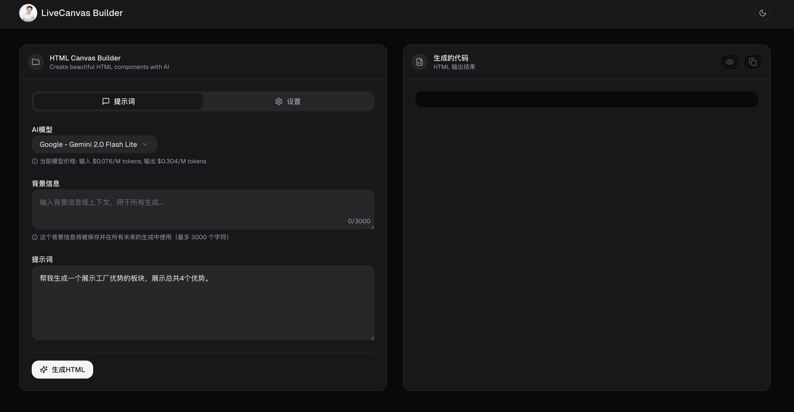

# Canvas Builder

<p align="center">
  
  
  
  
</p>

<p align="center">
  
</p>

[中文](README.zh-CN.md)

[Demo](https://livecanvas-builder.vercel.app/)

---

## 🌟 Overview

Canvas Builder is a powerful tool that leverages OpenRouter AI to generate Bootstrap 4 compatible HTML code for LiveCanvas. With a simple prompt, you can create beautiful, responsive web components ready to use in your LiveCanvas projects.

## ✨ Features

- **AI-Powered HTML Generation**: Uses OpenRouter AI to create Bootstrap 4 compatible HTML
- **SVG Icon Integration**: Automatically converts Lucide icons to inline SVG
- **Animation Support**: Built-in AOS (Animate On Scroll) integration
- **Version Management**: Track and switch between different generated code versions
- **Live Preview**: Instantly preview your generated HTML with responsive device simulation
- **Copy & Paste Ready**: Generated code is ready to use in LiveCanvas

## 🚀 Getting Started

### Prerequisites

- Node.js 18.x or higher
- Bun or npm
- OpenRouter API key ([Get one here](https://openrouter.ai/keys))

### Installation

1. Clone the repository:
   ```bash
   git clone https://github.com/yourusername/canvas-builder.git
   cd canvas-builder
   ```

2. Install dependencies:
   ```bash
   bun install
   # or
   npm install
   ```

3. Create environment file:
   ```bash
   cp .env.example .env
   ```

4. Add your OpenRouter API key to the `.env` file:
   ```
   OPENROUTER_API_KEY=your_api_key_here
   ```

5. Start the development server:
   ```bash
   bun dev
   # or
   npm run dev
   ```

6. Open [http://localhost:3000](http://localhost:3000) in your browser

## 💻 Usage

1. Enter your prompt in the text area describing the HTML component you want to create
2. Click "Generate HTML" button
3. View the generated HTML in the output panel
4. Use the device selector to preview how it looks on different devices
5. Copy the code or open the preview in a new tab
6. Paste the code directly into LiveCanvas

## 🔧 Advanced Features

- **Context Field**: Add persistent context that will be used for all generations
- **Version History**: Switch between different versions of generated code
- **Responsive Preview**: Test your HTML on mobile, tablet, and desktop views
- **Copy with CDN Links**: All image placeholders are automatically replaced with CDN URLs when copied

---

## 📝 MIT

[MIT](LICENSE)