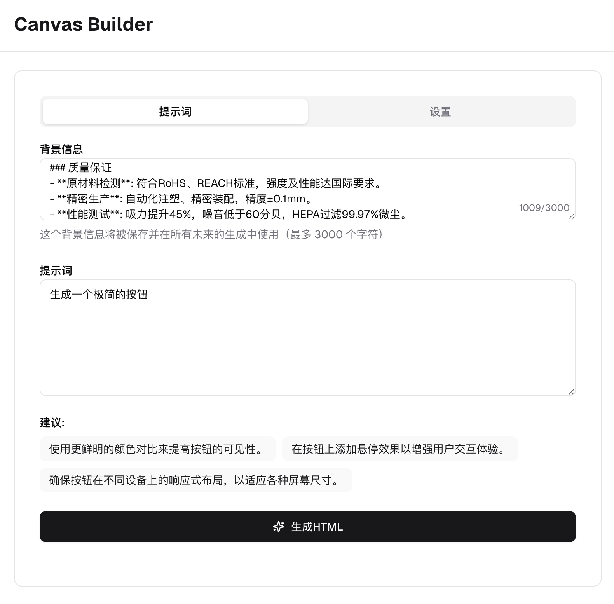

# Canvas Builder

<p align="center">
  
  
  
  
</p>

<p align="center">
  
</p>

[English](README.md)

[Demo](https://livecanvas-builder.vercel.app/)

---

## 🌟 概述

Canvas Builder 是一个强大的工具，利用 OpenRouter AI 为 LiveCanvas 生成兼容 Bootstrap 4 的 HTML 代码。通过简单的提示，您可以创建美观、响应式的网页组件，随时可用于您的 LiveCanvas 项目。

## ✨ 特点

- **AI 驱动的 HTML 生成**：使用 OpenRouter AI 创建兼容 Bootstrap 4 的 HTML
- **SVG 图标集成**：自动将 Lucide 图标转换为内联 SVG
- **动画支持**：内置 AOS（滚动时动画）集成
- **版本管理**：跟踪并切换不同的生成代码版本
- **实时预览**：通过响应式设备模拟立即预览您生成的 HTML
- **复制即用**：生成的代码可直接在 LiveCanvas 中使用

## 🚀 开始使用

### 前提条件

- Node.js 18.x 或更高版本
- Bun 或 npm
- OpenRouter API 密钥（[在此获取](https://openrouter.ai/keys)）

### 安装

1. 克隆仓库：
   ```bash
   git clone https://github.com/yourusername/canvas-builder.git
   cd canvas-builder
   ```

2. 安装依赖：
   ```bash
   bun install
   # 或
   npm install
   ```

3. 创建环境文件：
   ```bash
   cp .env.example .env
   ```

4. 在 `.env` 文件中添加您的 OpenRouter API 密钥：
   ```
   OPENROUTER_API_KEY=your_api_key_here
   ```

5. 启动开发服务器：
   ```bash
   bun dev
   # 或
   npm run dev
   ```

6. 在浏览器中打开 [http://localhost:3000](http://localhost:3000)

## 💻 使用方法

1. 在文本区域输入描述您想要创建的 HTML 组件的提示
2. 点击"生成 HTML"按钮
3. 在输出面板中查看生成的 HTML
4. 使用设备选择器预览在不同设备上的显示效果
5. 复制代码或在新标签页中打开预览
6. 直接将代码粘贴到 LiveCanvas 中

## 🔧 高级功能

- **上下文字段**：添加将用于所有生成的持久上下文
- **版本历史**：在生成代码的不同版本之间切换
- **响应式预览**：在移动设备、平板电脑和桌面视图上测试您的 HTML
- **带 CDN 链接的复制**：复制时，所有图像占位符都会自动替换为 CDN URL

---

## 📝 MIT

[MIT](LICENSE)